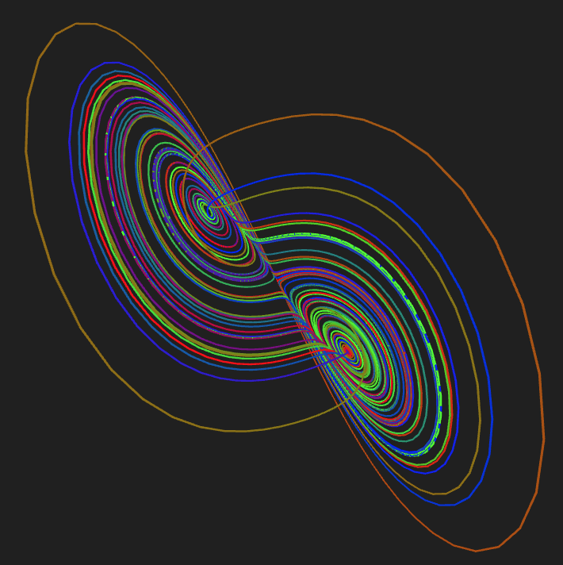

# lorenz-attractor
The Lorenz attractor rendered using p5.js

<h2>Controls:</h2>

click and drag mouse: look around 
W: move forwards 
A: move left 
S: move backwards 
D: move right 
space: move up 
shift: move down
